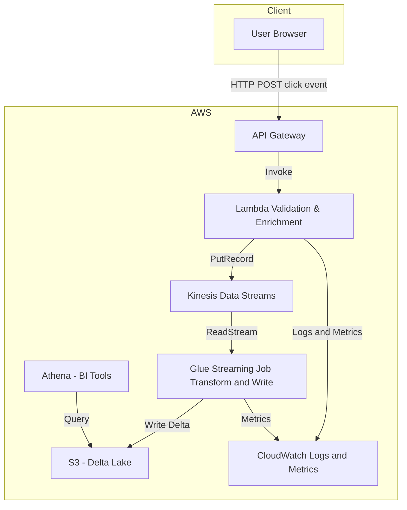

```mermaid
flowchart TD
    subgraph Client
        U[User Browser]
    end

    subgraph AWS
        direction LR
        APIGW[API Gateway]
        Lambda[Lambda Validation & Enrichment]
        Kinesis[Kinesis Data Streams]
        Glue[Glue Streaming Job Transform and Write]
        S3[S3 - Delta Lake]
        Athena[Athena - BI Tools]
        CW[CloudWatch Logs and Metrics]
    end

    U -->|HTTP POST click event| APIGW
    APIGW -->|Invoke| Lambda
    Lambda -->|PutRecord| Kinesis
    Kinesis -->|ReadStream| Glue
    Glue -->|Write Delta| S3
    Athena -->|Query| S3

    Lambda -->|Logs and Metrics| CW
    Glue -->|Metrics| CW
```
